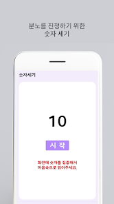
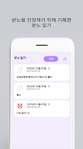
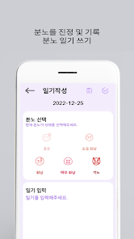
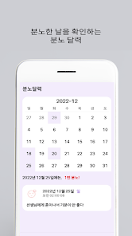
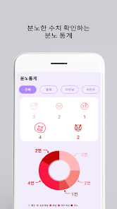

# 분노 진정( Angry Calm)

분노한 상태를 진정하기 위해서 글을 작성하거나 숫자를 세워보세요!
분노 주기를 측정하고, 통계를 통해 분노한 횟수를 파악해서 자신의 상태를 확인해보세요!

- 숫자 세기
: 분노한 상태를 진정하기 위해 화면에 나오는 숫자를 집중해서 세보세요!

- 분노 일기
: 분노한 상태를 진정하기 위해 현재 상황과 감정들을 글로 표현해보세요!

- 캘린더
: 달력을 통해 해당 일에 분노한 횟수 및 글에 대한 내용을 간편하게 볼 수 있습니다.

- 다양한 통계
: 각 주기 별 분노한 횟수와 수치를 파악할 수 있습니다.

# Using Teck Stack

## Using Screen

## 정보

이메일 – cksgud410@naver.com
Play Store - https://play.google.com/store/apps/details?id=com.tussle.angrycontrol

## 출처
MPAndroidChart (https://github.com/PhilJay/MPAndroidChart)

CalendarView (https://github.com/kizitonwose/CalendarView)
